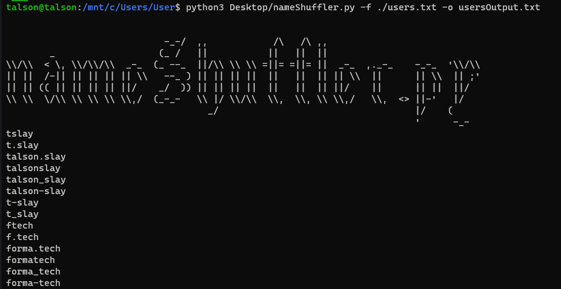

# nameShuffler.py



A python script to automate generating username lists of an existing list of 'first' and 'last' names. It's helpful while conducting a brute force attacks against usernames and/or emails on a specific network.

Usage:
```shell
~# python3 nameShuffler.py -f users.txt [-o output.txt] [-d domain.com]
```
> Note: The users.txt should consists of first and last names.
